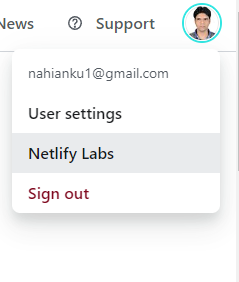
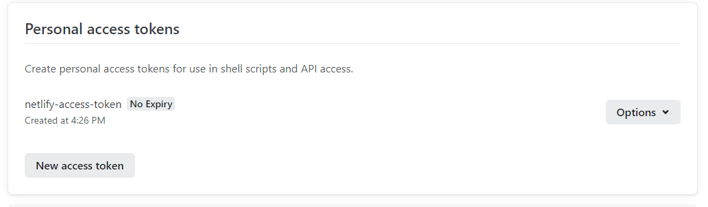
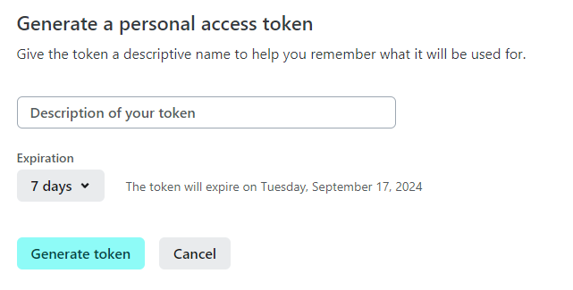
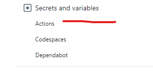
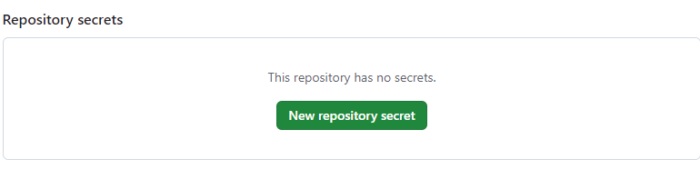
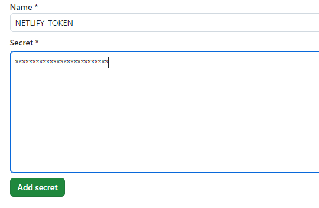
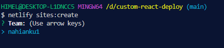
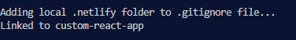

### Netlify Deployment Documentation:

--- 

##### General Uses:

```js
name: Deploy to Netlify

on:
  push:
    branches:
      - main

jobs:
  deploy:
    runs-on: ubuntu-latest
    steps:
      - name: Get code
        uses: actions/checkout@v3
      - name: Deploy to Netlify
        id: deploy
        uses: nahianku1/netlify-deploy@v1
        with:
          auth_token: ${{secrets.NETLIFY_TOKEN}}
          site_name: <YOUR_SITE_NAME>
      - name: Output URL
        run: echo "${{steps.deploy.outputs.live-url}}"

```
 **1. auth_token:** *This is required option.* 

 #### How to get Netlify Token:
 
 - First got netlify web site. Then crete or login to your netlify account. Under the user icon click user settings.

 

 - Then click Application on the left sidebar and click new access token.

  

  - Then on the new access token page give description and expiration date and click on generate token.

  

  - Then it will generate a new access token copy that.
  
  - Now come to your GitHub account and click on settings on top sidebar of the repository you want to push to. then click on actions under secrets and variables section of the left sidebar.

  

  - Now click on New Repository Secret
   
  

  - Now give a name and token you copied earlier. Click on add secret.

  

  
 **2. site_name:** *This is required option.* 

  #### How to get site name for your project:

  - Make netlify-cli is available globally or run ``` npm -g install netlify-cli ```

  - Create a new site using command: ```netlify sites:create```

  
  - Select your team and hit Enter.
  - Put a site name which should be available or leave it blank for random names. 

   

  - If you site is already linked to a site name run this command: ```netlify unlink```
  - Copy the link and paste to the site_name option.

   


 **3. build_directory:** *This is optional option.* Normally it is dist folder as **vite** does. But if you have different folder then put the option and give your corresponding folder.

 ```js
 
 name: Netlify Deployment

on:
  push:
    branches:
      - main

jobs:
  deploy:
    runs-on: ubuntu-latest
    steps:
      - name: Get code
        uses: actions/checkout@v3
      - name: deploy to netlify
        id: deploy
        uses: nahianku1/netlify-deploy@v1
        with:
          auth_token: ${{secrets.NETLIFY_TOKEN}}
          site_name: custom-react-app
          build_directory: build
      - name: Output URL
        run: echo "${{steps.deploy.outputs.live-url}}"

 
 ```

 


